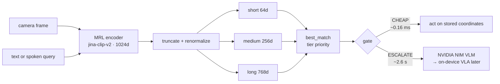

# robot-semantic-memory

**A cheap, truncatable visual memory that knows when a robot does *not* need
to wake an expensive model.**

A small Matryoshka-trained (MRL) multimodal encoder feeds a tiered vector
memory. A gate decides, per query, whether stored memory can answer — or
whether the question needs a vision-language model. Most of the time it
can't need one, because most of what a robot sees, it has already seen.

Runs today on a laptop with no NVIDIA GPU, against NVIDIA-hosted NIM
microservices. The encoder/memory/gate logic is hardware-agnostic and ports
to a Jetson unchanged.

---

## The problem

A robot that runs a vision-language model on every frame pays for a large
forward pass to answer questions it has already answered. That's slow, it's
power-hungry on a battery, and it occupies the one accelerator the robot has.

The interesting question isn't how to make the big model faster. It's how to
avoid calling it.

## The idea

**Matryoshka Representation Learning** trains an encoder so that *any prefix*
of its output vector is itself a valid embedding. One forward pass produces
1024 dimensions; the first 64, 256 or 768 of them each still mean something
on their own.

That turns one encode into three memory tiers with different costs:

| Tier | Dims | Bytes/entry | Role |
|---|---|---|---|
| short | 64 | 256 | "what did I just see" — always-on, decays after 30 s |
| medium | 256 | 1024 | "what have I learned" — labelled, consolidated |
| long | 768 | 3072 | "what do I know well" — durable |

A fixed-width baseline (NVIDIA's `llama-nemotron-embed-vl-1b-v2`, 2048 dims)
has no cheaper option: every memory costs 8192 bytes whether you need the
precision or not.

> **An important caveat, stated up front:** truncation does **not** make the
> encoder cheaper. The backbone runs once regardless of how many dimensions
> you keep. What truncation buys is cheaper *storage* and cheaper
> *comparison*. See `src/encoder.py`.



The gate escalates on three conditions: the best match is below that tier's
novelty threshold (never seen this), below its confidence threshold (weak
match), or the task needs manipulation (memory knows *where*, not *how*).

### The non-obvious part

Cosine scores from different truncation widths **are not comparable**.
Truncating an MRL embedding *systematically raises* similarity — the dropped
dimensions are the discriminative ones. Measured, same image/text pair:

```
long (768d) = 0.354    medium (256d) = 0.386    short (64d) = 0.435
```

So a narrow tier looks *more confident* while being *less able to tell things
apart*. Picking the highest score across tiers — the obvious implementation —
always returns the 64-dim tier, which is stored unlabelled and has the worst
Recall@1. That was a real bug here; it made every query report `label=None`
and broke novelty detection entirely.

The fix is `MemoryStore.best_match()`: walk tiers in priority order, each with
its own threshold. It's regression-tested in
`tests/test_core.py::TestBestMatchRegression`, including a test asserting that
the *old* behaviour would still pick the short tier — so the fixture can't
silently stop covering the bug.

## Measured results

Numbers from this machine (MacBook, CPU only). Reproduce with
`python verify_offline.py --live` and `python evaluate_tiers.py <manifest> --calibrate`.

| Result | Measured | What it means |
|---|---|---|
| Memory lookup | **0.16 ms** | vs ~2.6 s to escalate — **~16,000× cheaper** |
| Storage | **16 KB vs 64 KB** | **4× less** than the 2048-dim fixed-width baseline |
| Cross-modal retrieval | 4/4 (baseline), 3/4 (local) | text query → correct image, synthetic scenes |
| Escalation on unseen objects | correct | novelty detection fires after the `best_match` fix |
| Unit tests | 44 passing, <1 s | no model, network or camera needed |

**The honest one:** on this hardware the cheap/expensive comparison
**inverts**. The local text tower (561M params, CPU, ~0.5–1.8 s) is *slower*
in wall-clock than a hosted 11B VLM answering from datacentre GPUs (~1.0 s).
`metrics.py` prints a loud warning when that happens and puts the blended
figure last, under a "do NOT lead with this" heading. The architectural
claims — lookup cost and storage — hold on any hardware; wall-clock latency
is the wrong axis until the encoder runs on a Jetson under TensorRT.

## What this does *not* claim

- **Not** that the cheap path is faster per call — measured false here.
- **Not** that truncation saves encoder compute — it doesn't.
- **Not** anything measured on a Jetson, under TensorRT, or on Isaac GR00T.
  The hosted VLM is a *stand-in* for the escalation target, running on better
  hardware than the local encoder.
- **Not** a benchmark. Recall@1 comes from a small hand-photographed object
  set; treat it as an illustration, not a published result.

## NVIDIA technology used

| Component | Role | Status |
|---|---|---|
| `llama-nemotron-embed-vl-1b-v2` (NIM) | fixed-width baseline embedder, 2048d | running |
| `llama-3.2-11b-vision-instruct` (NIM) | escalation target, stands in for a VLA | running |
| `parakeet-ctc-0.6b` (Riva ASR, gRPC) | spoken query → text | running |
| `magpie-tts-multilingual` (Riva TTS, gRPC) | spoken answer | running |
| Jetson Orin Nano Super | move encoder + memory on-device | next step |
| TensorRT | collapse the encoder latency | next step |
| Isaac GR00T N1 | replace the VLM stand-in with a real VLA | next step |

The bottom three have **not** been run. The gate doesn't know what sits behind
it, so swapping the escalation target is one function —
`nvidia_nim.call_vlm_escalation()`.

## What's here

```
robot-semantic-memory/
  requirements.txt
  .env.example           # copy to .env, fill in your NVIDIA keys/IDs
  src/
    encoder.py            # jina-clip-v2 wrapper: embed_image, embed_text, truncate
    memory_store.py        # tiered (short/medium/long) vector store, brute-force cosine search
    gate.py                 # confidence/novelty thresholds -> CHEAP vs ESCALATE decision
    nvidia_nim.py            # fixed-width baseline embedder + VLM escalation, NIM REST
    riva_voice.py             # voice in/out via NVIDIA Riva Speech NIM, gRPC
    metrics.py                # logs decisions, computes the value-prop numbers
    frame_source.py           # camera index / stills folder / live --watch file
  demo_webcam.py           # original offline-only demo — no keys needed, safe fallback
  demo_live.py             # full NVIDIA-integrated demo (baseline embedder + Riva + VLM + metrics)
  evaluate_tiers.py        # Recall@1 per tier, and --calibrate for gate thresholds
  verify_offline.py        # camera-free/keyless integration smoke test — run this first
  camera_bridge.py         # publish camera frames to a file (for permission-less consumers)
  tests/test_core.py       # 44 hermetic unit tests: no model, no network, no camera
```

## Setup

```bash
cd robot-semantic-memory
python3 -m venv .venv
source .venv/bin/activate        # Windows: .venv\Scripts\activate
pip install -r requirements.txt
cp .env.example .env
# now edit .env — see "Which NVIDIA keys you need" below
```

First run of `demo_webcam.py`/`demo_live.py` will download the
jina-clip-v2 weights (~a few hundred MB) — needs network once, then it's
cached locally.

## Which NVIDIA keys you need

1. **`NVIDIA_API_KEY`** — one key covers the baseline embedder, the VLM call,
   and Riva auth. Get it free at `build.nvidia.com` (sign up, verify
   email, open any model page, "Get API Key").
2. **`RIVA_ASR_FUNCTION_ID`** and **`RIVA_TTS_FUNCTION_ID`** — these are
   function **UUIDs**, NOT API keys. Putting an `nvapi-…` key here is a
   silent trap: the gRPC call connects and then fails with
   `StatusCode.INTERNAL`. List the real ones for your account with:
   ```bash
   curl -s https://api.nvcf.nvidia.com/v2/nvcf/functions \
     -H "Authorization: Bearer $NVIDIA_API_KEY" | python3 -m json.tool
   ```
   Currently in use: `d8dd4e9b-fbf5-4fb0-9dba-8cf436c8d965`
   (`ai-parakeet-ctc-0_6b-asr`) and `877104f7-e885-42b9-8de8-f6e4c6303969`
   (`ai-magpie-tts-multilingual`).
3. **`BASELINE_EMBED_MODEL`** / **`VLM_MODEL`** — model identifier strings.
   Confirm against `GET /v1/models` on `integrate.api.nvidia.com`. Two traps
   found the hard way: **`nvidia/nvclip` is discontinued** and always 404s
   (use `nvidia/llama-nemotron-embed-vl-1b-v2`, which is multimodal and
   fixed-width 2048), and `meta/llama-3.2-90b-vision-instruct`
   read-times-out on this account even for a text-only request (use the
   `11b` variant). A leftover `NVCLIP_MODEL=` line takes precedence over
   `BASELINE_EMBED_MODEL`, so delete it rather than commenting it out.

## Recommended order of testing (don't jump straight to the full demo)

0. `python -m unittest discover -s tests` — 44 unit tests, no model,
   network or camera needed. Under a second. Start here.
1. `python verify_offline.py` — integration smoke test with the real
   encoder; no camera and no keys. Add `--live` to include NIM and Riva.
   **Run this first on a new machine** — it names the broken layer.
2. `python demo_webcam.py` — the core loop, no keys. Needs camera
   permission (see "Run the demo"); `--images DIR` runs it without one.
3. `python src/nvidia_nim.py path/to/any_test_image.jpg` — the baseline
   embedder and the VLM call in isolation.
4. `python src/riva_voice.py` — mic recording, ASR and TTS in isolation.
5. `python demo_live.py` — the full thing, once the above pass.
6. `python evaluate_tiers.py test_objects/manifest.json --calibrate
   --write-thresholds thresholds.json` — real Recall@1 per tier for the
   metrics recap, and the gate thresholds measured from your own photos.

Verified against a live key on 2026-09-04: all of the above passes —
44/44 unit tests, and the baseline embedder, VLM escalation, Riva TTS and
Riva ASR all confirmed against live endpoints.

If you need live camera frames in a process that can't be granted the
camera, run `python3 camera_bridge.py` from Terminal.app and pass
`--watch .camera_feed/latest.jpg` to any of the above.

## Run the demo

**Launch from Terminal.app.** macOS gates the camera per process, and a
process whose app bundle doesn't declare `NSCameraUsageDescription` gets no
permission prompt *and* no System Settings entry — every camera index then
fails with `not authorized to capture video` (under ffmpeg it hangs rather
than erroring, so it can look like a freeze). Terminal is the responsible
app for what it launches and does get prompted:

```bash
cd ~/Documents/robot-semantic-memory && python3 demo_webcam.py
```

Allow the prompt on first run. To pick a camera when you have several:

```bash
ffmpeg -f avfoundation -list_devices true -i ""   # list them with indices
python3 demo_webcam.py --camera 1                  # or ROBOT_CAMERA_INDEX=1
python3 demo_webcam.py --images test_objects       # no camera at all
```

Click the video window so it has keyboard focus, then:

- `w a s d` — move a *simulated* robot position (stand-in for odometry)
- `m` — memorize the current frame into medium-term memory (you'll be
  asked for a label in the terminal, e.g. "red mug on shelf")
- `space` — type a text query (e.g. "where is the red mug") and watch it:
  1. get embedded into the same space as the images
  2. get compared against everything in memory
  3. produce a gate decision (CHEAP → prints the coordinates to navigate
     to; ESCALATE → in demo_webcam.py hits a local stub; in demo_live.py
     makes a real call to an NVIDIA-hosted VLM)

Every ~10 frames also gets written into short-term memory automatically,
so you can see that tier filling and then decaying (it prunes anything
older than 30 seconds).

## Try this to build intuition

1. Memorize an object ("m") with a clear label.
2. Move the simulated position elsewhere ("w"/"a"/"s"/"d" a few times).
3. Query for that object by description ("space") — you should get a
   CHEAP decision pointing back at the coordinates you memorized it at.
4. Query for something you never memorized — you should get an ESCALATE
   decision because similarity to everything stored falls below the
   novelty threshold.
5. Query using the word "pick" or "grasp" — notice it escalates
   regardless of similarity, because that's a manipulation task memory
   alone can't finish (see `gate.py`'s `requires_manipulation` flag).
6. Open `gate.py` and change `CONFIDENCE_THRESHOLD` / `NOVELTY_THRESHOLD`
   — see how it changes which queries stay cheap. Better: run
   `evaluate_tiers.py --calibrate` and set them from measured data instead
   of by feel. The gate prints which thresholds are in force at startup.
7. Watch the `per-tier top-1` line on each query. Scores go *up* as
   dimensions go *down* — that's truncation bias, not the 64-dim tier
   being better, and it's why the tiers get separate thresholds. See
   `MemoryStore.best_match()`.

## Current limitations

- **No real VLA.** `demo_live.py` makes a genuine network call to an
  NVIDIA-hosted VLM, so the escalation path and its latency are real — but a
  chat vision model is not an action model. It answers *what it sees*, not
  *how to move*. Swapping in a real VLA (Isaac GR00T, OpenVLA, π0) is one
  function: `nvidia_nim.call_vlm_escalation()`. `demo_webcam.py` keeps a
  local stub so the offline fallback needs no keys.
- **No real spatial metadata.** Position is a keyboard-controlled toy
  variable. On the robot this comes from wheel odometry (encoder ticks)
  or visual odometry, not from you pressing "w."
- **Gate thresholds need calibrating per environment.** They print
  `PROVISIONAL defaults (not calibrated)` at startup until you run
  `evaluate_tiers.py --calibrate` against your own photographs. The shipped
  values are corrected for dimensional bias but are not tuned to real data.
- **No ANN index.** `memory_store.py` does a brute-force numpy scan.
  Fine up to low thousands of entries — swap in `hnswlib` or similar only
  if you actually outgrow that.
- **Small evaluation set.** Recall@1 comes from a hand-photographed object
  set of roughly a dozen items. Enough to show the shape of the
  degradation curve across tiers; not enough to publish.

## Path to the real Jetson + chassis build

1. **Swap the camera source.** Add a Jetson CSI branch to
   `src/frame_source.py` (GStreamer via OpenCV, or `jetson-utils`) — the
   demos already go through `FrameSource`, so nothing else changes.
   Everything downstream (`embed_image`, `MemoryStore`, `gate.decide`) is
   untouched.
2. **Replace simulated position with real odometry.** Read wheel
   encoder ticks (or IMU + simple dead reckoning) into `(x, y)` instead
   of the `w/a/s/d` stand-in.
3. **Automate "memorize" instead of a keypress.** Once frames are
   arriving continuously, decide programmatically when to consolidate
   short-term → medium-term (e.g. when a region of the scene has been
   stable/novel for N consecutive frames — this is your first real
   "event detection" logic, replacing the manual `m` key).
4. **Benchmark on-device.** Re-run the encoder on the actual Jetson Orin
   Nano Super and measure real latency/power — the deck's numbers are
   illustrative; this is where you get your own.

   This is the step that fixes the one genuinely awkward measurement in
   the current build. On a MacBook CPU the *cheap* path is **slower** than
   the *expensive* one: jina-clip-v2's text tower is 561M params on CPU
   (~0.5–1.8s per query) while the hosted 11B VLM answers from datacentre
   GPUs in ~1.0s. `metrics.py` prints a loud warning when the comparison
   inverts like this. The memory lookup itself is ~0.08ms — roughly
   14,000x cheaper than escalating — so the architecture is sound; it's
   the local encoder that needs the Jetson and TensorRT. Until then, quote
   the per-stage numbers, not the blended one.
5. **Wire in the VLA.** Replace `call_vla_stub()` with a real inference
   call once you've picked a model and a serving strategy (on-device
   quantized, or a call out to a workstation/cloud endpoint — worth
   deciding based on the latency numbers you just measured).
6. **Add the motor control loop.** The cheap path's "navigate toward
   (x, y)" is currently just a `print()`. This is where it becomes an
   actual differential-drive controller.

Each of these is a self-contained next step — you don't need the
chassis to make progress on 1–3, and you don't need the VLA decided to
make progress on the memory system, which is exactly the point of
building it in this order.
